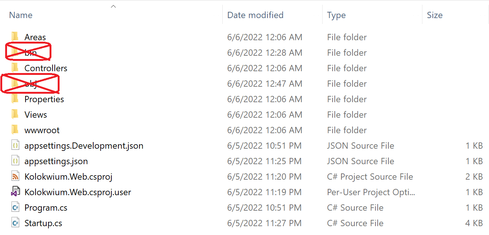

# Kolokwium
## Przygotowanie do kolokwium:
### Pobranie gałęzi oraz przygotowanie projektów
1) Proszę pobrać gałąź kolokwium w formie pliku zip. A następnie wypakować jego zawartość.
  </img>
2) Proszę uruchomić Visual Studio, a następnie w wypakowanym wcześniej folderze stworzyć solucję o nazwie `Kolokwium` oraz dwa poniższe projekty:
    - `Kolokwium.App` typu Console Application,
    - `Kolokwium.BLL` typu Class library.
3) Proszę ustanowić zależność (dependency) pomiędzy `Kolokwium.App` a `Kolokwium.BLL`. Projekt  `Kolokwium.App` powinien posiadać zależność od `Kolokwium.BLL` ( `Kolokwium.App` => `Kolokwium.BLL`). 
4) Proszę skompilować całą solucję klikając PPM w `Solution Explorerze` na Solucji `Kolokwium` a następnie wybierając `Build Solution`.

    

5) Proszę stworzyć wszystkie elementy kolokwium (klasy, interfejsy, etc.) w projekcie `Kolokwium.BLL`. 
```diff
- UWAGA: W przypadku umieszczenia elementów kolokwium w innym miejscu, spowoduje to znaczne obniżenie oceny lub uzyskanie oceny niedostatecznej. 
```
  Jedynym elementem który należy umieścić w projekcie `Kolokwium.App` jest kod testujący. Znajduje się on pod poniższym adresem:
  [https://ik2a.kik.pcz.pl/po/{code}.pdf](http://ik2a.kik.pcz.czest.pl/po/code.pdf)
  Proszę zastąpić `{code}` wartością kodu podaną przez prowadzącego.

### Proszę przejść do wykonywania zadań

```diff
- Życzę Państwu powodzenia podczas kolokwium! :)
```
### Umieszenie rozwiązania w archiwum
1)  Po zakończeniu czasu przeznaczonego na kolokwium, proszę klinąć PPM w `Solution Explorerze` na Solucji `Kolokwium` a następnie wybrać `Clean Solution`.
    
2)  Proszę w folderze `Programowanie_obiektowe_S-kolokwium1` wykonać poniższe polecenia.
    ```powershell
    Remove-Item Kolokwium/Kolokwium.App/bin -Recurse -Force
    Remove-Item Kolokwium/Kolokwium.App/obj -Recurse -Force
    Remove-Item Kolokwium/Kolokwium.BLL/bin -Recurse -Force
    Remove-Item Kolokwium/Kolokwium.BLL/obj -Recurse -Force
    ```
    Proszę się upewnić że foldery `bin` i `obj` zostały usunięte ze wszystkich projektów.
    
    </img>

3)  Następnie proszę spakować rozwiązanie przy pomocy poniższego kodu (ewentualnie proszę spakować folder `Kolokwium` ręcznie przy pomocy `7zip`). Plik `Rozwiazanie_Kolokwium.zip` będzie znajdował sie w folderze `Programowanie_obiektowe_S-kolokwium1`

    ```
    tar caf Rozwiazanie_Kolokwium.zip --exclude=./Rozwiazanie_Kolokwium.zip Kolokwium 
    ```
    
4)  Proszę przejść pod adres [Archiver](https://ik2a.kik.pcz.pl/archiver/TestArchive/Index)
5)  Następnie proszę wybrać Państwa test i kilknąć przycisk `Link`

    
    
6)  Proszę wypełnić formularz podając swoje dane, wskazać plik `Rozwiazanie_Kolokwium.zip`, a następnie nacisnąc przycisk `Upload`

    
    
 
