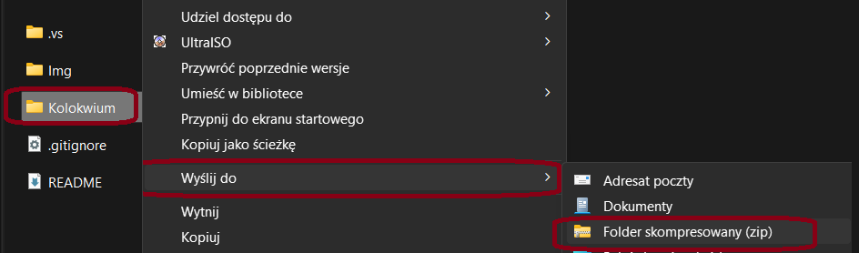

# Kolokwium 2
## Przygotowanie do kolokwium:
### Pobranie gałęzi oraz przygotowanie projektów
1) Proszę pobrać gałąź kolokwium w formie pliku zip. A następnie wypakować jego zawartość.
  </img>
2) W kolejnym kroku prosze ustwić projekt startowy (`Set startup project`) na `Kolokwium.WpfApp`  
3) Następnie proszę uruchomić `Visual Studio 2022` i otworzyć solucję `Kolokwium.sln`.  
3) Proszę skompilować całą solucję klikając PPM w `Solution Explorerze` na Solucji `Kolokwium` a następnie wybierając `Build Solution`.

    

4) Proszę otworzyć plik `Kolokwium.Web -> appsettings.json` a następnie podmienić wartość `Database` connection stringa podając swoje imię i nazwisko (bez znaków diakrytycznych) zamiast `Imie_Nazwisko`. Dzięki temu w momencie zastosowania pierwszej migracji utworzy się nowa baza danych zaczynającą się Państwa imieniem i nazwiskiem.
    ```json
    {
      "ConnectionStrings": {
        "DefaultConnection": "Server=(localdb)\\mssqllocaldb;Database=Imie_Nazwisko_Kolokwium2_AppDb;Trusted_Connection=True;MultipleActiveResultSets=true"
      },
      "Logging": {
        "LogLevel": {
          "Default": "Information",
          "Microsoft": "Warning",
          "Microsoft.Hosting.Lifetime": "Information"
        }
      },
      "AllowedHosts": "*"
    }
    ```  
5) Proszę stworzyć wszystkie elementy modelu w projekcie `Kolokwium.Model`, natomiast wszystkie elementy dostępu do danych tj. `ApplicationDbContext` w projekcie `Kolokwium.DAL`. 
```diff
- UWAGA: W przypadku umieszczenia elementów kolokwium w innym miejscu niż powyższej określone, spowoduje znaczne obniżenie oceny lub uzyskanie oceny niedostatecznej. 
```
### Proszę przejść do wykonywania zadań

```diff
- Życzę Państwu powodzenia podczas kolokwium! :)
```
### Umieszenie rozwiązania w archiwum
1)  Po zakończeniu czasu przeznaczonego na kolokwium, proszę klinąć PPM w `Solution Explorerze` na Solucji `Kolokwium` a następnie wybrać `Clean Solution`.
    
2)  Proszę usunąc foldery `bin` i `obj` ze wszystkich projektów.
    
    </img>
 
3)  Następnie proszę spakować całą solucję do pliku `*.zip` (nazwa dowolna). 
 
    </img>

    ```
5)  Proszę przejść pod adres [Archiver](https://ik2a.kik.pcz.pl/archiver/TestArchive/Index)
6)  Następnie proszę wybrać Państwa test i kilknąć przycisk `Link`

    
    
7)  Proszę wypełnić formularz podając swoje dane, wskazać plik `*.zip` (można równeż przeciągnąć), a następnie nacisnąc przycisk `Upload`

    
    
 
